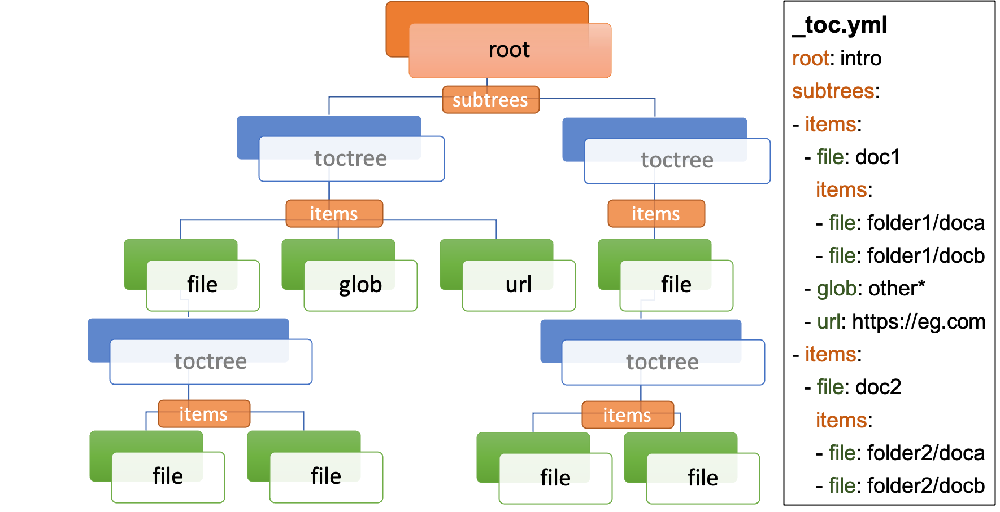

# sphinx-external-toc [IN-DEVELOPMENT]

[![Github-CI][github-ci]][github-link]
[![Coverage Status][codecov-badge]][codecov-link]
[![Code style: black][black-badge]][black-link]
[![PyPI][pypi-badge]][pypi-link]

A sphinx extension that allows the documentation site-map (a.k.a Table of Contents) to be defined external to the documentation files.

In normal Sphinx documentation, the documentation site-map is defined *via* a bottom-up approach - adding [`toctree` directives](https://www.sphinx-doc.org/en/master/usage/restructuredtext/directives.html#table-of-contents) within pages of the documentation.

This extension facilitates a **top-down** approach to defining the site-map structure, within a single YAML file.



It also allows for documents not specified in the ToC to be auto-excluded.

## User Guide

### Sphinx Configuration

Add to your `conf.py`:

```python
extensions = ["sphinx_external_toc"]
external_toc_path = "_toc.yml"  # optional, default: _toc.yml
external_toc_exclude_missing = False  # optional, default: False
```

Note the `external_toc_path` is always read as a Unix path, and can either be specified relative to the source directory (recommended) or as an absolute path.

### Basic Structure

A minimal ToC defines the top level `root` key, for a single root document file:

```yaml
root: intro
```

The value of the `root` key will be a path to a file, in Unix format (folders split by `/`), relative to the source directory, and can be with or without the file extension.

:::{note}
This root file will be set as the [`master_doc`](https://www.sphinx-doc.org/en/master/usage/configuration.html#confval-master_doc).
:::

Document files can then have a `subtrees` key - denoting a list of individual toctrees for that document - and in-turn each subtree should have a `items` key - denoting a list of children links, that are one of:

- `file`: path to a single document file in Unix format,  with or without the file extension (as for `root`)
- `glob`: path to one or more document files *via* Unix shell-style wildcards (similar to [`fnmatch`](https://docs.python.org/3/library/fnmatch.html), but single stars don't match slashes.)
- `url`: path for an external URL (starting e.g. `http` or `https`)

:::{important}
Each document file can only occur once in the ToC!
:::

This can proceed recursively to any depth.

```yaml
root: intro
subtrees:
- items:
  - file: doc1
    subtrees:
    - items:
      - file: doc2
        subtrees:
        - items:
          - file: doc3
  - url: https://example.com
  - glob: subfolder/other*
```

This is equivalent to having a single `toctree` directive in `intro`, containing `doc1`,
and a single `toctree` directive in `doc1`, with the `:glob:` flag and containing `doc2`, `https://example.com` and `subfolder/other*`.

As a shorthand, the `items` key can be at the same level as the `file`, which denotes a document with a single subtree.
For example, this file is exactly equivalent to the one above:

```yaml
root: intro
items:
- file: doc1
  items:
  - file: doc2
    items:
    - file: doc3
- url: https://example.com
- glob: subfolder/other*
```

### File and URL titles

By default, the initial header within a `file` document will be used as its title in generated Table of Contents.
With the `title` key you can set an alternative title for a document. and also for `url`:

```yaml
root: intro
subtrees:
- items:
  - file: doc1
    title: Document 1 Title
  - url: https://example.com
    title: Example URL Title
```

### ToC tree options

Each subtree can be configured with a number of options (see also [sphinx `toctree` options](https://www.sphinx-doc.org/en/master/usage/restructuredtext/directives.html#directive-toctree)):

- `caption` (string): A title for the whole the subtree, e.g. shown above the subtree in ToCs
- `hidden` (boolean): Whether to show the ToC within (inline of) the document (default `False`).
  By default it is appended to the end of the document, but see also the `tableofcontents` directive for positioning of the ToC.
- `maxdepth` (integer): A maximum nesting depth to use when showing the ToC within the document (default -1, meaning infinite).
- `numbered` (boolean or integer): Automatically add numbers to all documents within a subtree (default `False`).
  If set to `True`, all sub-trees will also be numbered based on nesting (e.g. with `1.1` or `1.1.1`),
  or if set to an integer then the numbering will only be applied to that depth.
- `reversed` (boolean): If `True` then the entries in the subtree will be listed in reverse order (default `False`).
  This can be useful when using `glob` items.
- `titlesonly` (boolean): If `True` then only the first heading in the document will be shown in the ToC, not other headings of the same level (default `False`).

These options can be set at the level of the subtree:

```yaml
root: intro
subtrees:
- caption: Subtree Caption
  hidden: False
  maxdepth: 1
  numbered: True
  reversed: False
  titlesonly: True
  items:
  - file: doc1
    subtrees:
    - titlesonly: True
      items:
      - file: doc2
```

or, if you are using the shorthand for a single subtree, set options under an `options` key:

```yaml
root: intro
options:
  caption: Subtree Caption
  hidden: False
  maxdepth: 1
  numbered: True
  reversed: False
  titlesonly: True
items:
- file: doc1
  options:
    titlesonly: True
  items:
  - file: doc2
```

You can also use the top-level `defaults` key, to set default options for all subtrees:

```yaml
root: intro
defaults:
  titlesonly: True
options:
  caption: Subtree Caption
  hidden: False
  maxdepth: 1
  numbered: True
  reversed: False
items:
- file: doc1
  items:
  - file: doc2
```

:::{warning}
`numbered` should not generally be used as a default, since numbering cannot be changed by nested subtrees, and sphinx will log a warning.
:::

:::{note}
By default, title numbering restarts for each subtree.
If you want want this numbering to be continuous, check-out the [sphinx-multitoc-numbering extension](https://github.com/executablebooks/sphinx-multitoc-numbering).
:::

### Using different key-mappings

For certain use-cases, it is helpful to map the `subtrees`/`items` keys to mirror e.g. an output [LaTeX structure](https://www.overleaf.com/learn/latex/sections_and_chapters).

The `format` key can be used to provide such mappings (and also initial defaults).
Currently available:

- `jb-article`:
  - Maps `items` -> `sections`
  - Sets the default of `titlesonly` to `true`
- `jb-book`:
  - Maps the top-level `subtrees` to `parts`
  - Maps the top-level `items` to `chapters`
  - Maps other levels of `items` to `sections`
  - Sets the default of `titlesonly` to `true`

For example:

```yaml
defaults:
  titlesonly: true
root: index
subtrees:
- items:
  - file: doc1
    items:
    - file: doc2
```

is equivalent to:

```yaml
format: jb-book
root: index
parts:
- chapters:
  - file: doc1
    sections:
    - file: doc2
```

:::{important}
These change in key names do not change the output site-map structure.
:::

## Add a ToC to a page's content

By default, the `toctree` generated per document (one per subtree) are appended to the end of the document and hidden (then, for example, most HTML themes show them in a side-bar).
But if you would like them to be visible at a certain place within the document body, you may do so by using the `tableofcontents` directive:

ReStructuredText:

```restructuredtext
.. tableofcontents::
```

MyST Markdown:

````md
```{tableofcontents}
```
````

Currently, only one `tableofcontents` should be used per page (all `toctree` will be added here), and only if it is a page with child/descendant documents.

Note, this will override the `hidden` option set for a subtree.

## Excluding files not in ToC

By default, Sphinx will build all document files, regardless of whether they are specified in the Table of Contents, if they:

1. Have a file extension relating to a loaded parser (e.g. `.rst` or `.md`)
2. Do not match a pattern in [`exclude_patterns`](https://www.sphinx-doc.org/en/master/usage/configuration.html#confval-exclude_patterns)

To automatically add any document files that do not match a `file` or `glob` in the ToC to the `exclude_patterns` list, add to your `conf.py`:

```python
external_toc_exclude_missing = True
```

Note that, for performance, files that are in *hidden folders* (e.g. in `.tox` or `.venv`) will not be added to `exclude_patterns` even if they are not specified in the ToC.
You should exclude these folders explicitly.

## Command-line

This package comes with the `sphinx-etoc` command-line program, with some additional tools.

To see all options:

```console
$ sphinx-etoc --help
Usage: sphinx-etoc [OPTIONS] COMMAND [ARGS]...

  Command-line for sphinx-external-toc.

Options:
  --version   Show the version and exit.
  -h, --help  Show this message and exit.

Commands:
  from-site  Create a ToC file from a site directory.
  migrate    Migrate a ToC from a previous revision.
  parse      Parse a ToC file to a site-map YAML.
  to-site    Create a site directory from a ToC file.
```

To build a template site from only a ToC file:

```console
$ sphinx-etoc to-site -p path/to/site -e rst path/to/_toc.yml
```

Note, you can also add additional files in `meta`/`create_files` amd append text to the end of files with `meta`/`create_append`, e.g.

```yaml
root: intro
items:
- glob: doc*
meta:
  create_append:
    intro: |
      This is some
      appended text
  create_files:
  - doc1
  - doc2
  - doc3
```

To build a ToC file from an existing site:

```console
$ sphinx-etoc from-site path/to/folder
```

Some rules used:

- Files/folders will be skipped if they match a pattern added by `-s` (based on [fnmatch](https://docs.python.org/3/library/fnmatch.html) Unix shell-style wildcards)
- Sub-folders with no content files inside will be skipped
- File and folder names will be sorted by [natural order](https://en.wikipedia.org/wiki/Natural_sort_order)
- If there is a file called `index` (or the name set by `-i`) in any folder, it will be treated as the index file, otherwise the first file by ordering will be used.

The command can also guess a `title` for each file, based on its path:

- The folder name is used for index files, otherwise the file name
- Words are split by `_`
- The first "word" is removed if it is an integer

For example, for a site with files:

```
index.rst
1_a_title.rst
11_another_title.rst
.hidden_file.rst
.hidden_folder/index.rst
1_a_subfolder/index.rst
2_another_subfolder/index.rst
2_another_subfolder/other.rst
3_subfolder/1_no_index.rst
3_subfolder/2_no_index.rst
14_subfolder/index.rst
14_subfolder/subsubfolder/index.rst
14_subfolder/subsubfolder/other.rst
```

will create the ToC:

```console
$ sphinx-etoc from-site path/to/folder -i index -s ".*" -e ".rst" -t
root: index
items:
- file: 1_a_title
  title: A title
- file: 11_another_title
  title: Another title
- file: 1_a_subfolder/index
  title: A subfolder
- file: 2_another_subfolder/index
  title: Another subfolder
  items:
  - file: 2_another_subfolder/other
    title: Other
- file: 3_subfolder/1_no_index
  title: No index
  items:
  - file: 3_subfolder/2_no_index
    title: No index
- file: 14_subfolder/index
  title: Subfolder
  items:
  - file: 14_subfolder/subsubfolder/index
    title: Subsubfolder
    items:
    - file: 14_subfolder/subsubfolder/other
      title: Other
```

## API

The ToC file is parsed to a `SiteMap`, which is a `MutableMapping` subclass, with keys representing docnames mapping to a `Document` that stores information on the toctrees it should contain:

```python
import yaml
from sphinx_external_toc.parsing import parse_toc_yaml
path = "path/to/_toc.yml"
site_map = parse_toc_yaml(path)
yaml.dump(site_map.as_json())
```

Would produce e.g.

```yaml
root: intro
documents:
  doc1:
    docname: doc1
    subtrees: []
    title: null
  intro:
    docname: intro
    subtrees:
    - caption: Subtree Caption
      numbered: true
      reversed: false
      items:
      - doc1
      titlesonly: true
    title: null
meta: {}
```

## Development Notes

Questions / TODOs:

- Add additional top-level keys, e.g. `appendices` (see https://github.com/sphinx-doc/sphinx/issues/2502) and `bibliography`
- Using `external_toc_exclude_missing` to exclude a certain file suffix:
  currently if you had files `doc.md` and `doc.rst`, and put `doc.md` in your ToC,
  it will add `doc.rst` to the excluded patterns but then, when looking for `doc.md`,
  will still select `doc.rst` (since it is first in `source_suffix`).
  Maybe open an issue on sphinx, that `doc2path` should respect exclude patterns.
- Integrate https://github.com/executablebooks/sphinx-multitoc-numbering into this extension? (or upstream PR)
- document suppressing warnings
- test against orphan file
- https://github.com/executablebooks/sphinx-book-theme/pull/304
- CLI command to generate toc from existing documentation `toctrees` (and then remove toctree directives)
- test rebuild on toc changes (and document how rebuilds are controlled when toc changes)
- some jupyter-book issues point to potential changes in numbering, based on where the `toctree` is in the document.
  So could look into placing it e.g. under the first heading/title

[github-ci]: https://github.com/executablebooks/sphinx-external-toc/workflows/continuous-integration/badge.svg?branch=main
[github-link]: https://github.com/executablebooks/sphinx-external-toc
[codecov-badge]: https://codecov.io/gh/executablebooks/sphinx-external-toc/branch/main/graph/badge.svg
[codecov-link]: https://codecov.io/gh/executablebooks/sphinx-external-toc
[black-badge]: https://img.shields.io/badge/code%20style-black-000000.svg
[black-link]: https://github.com/ambv/black
[pypi-badge]: https://img.shields.io/pypi/v/sphinx-external-toc.svg
[pypi-link]: https://pypi.org/project/sphinx-external-toc
