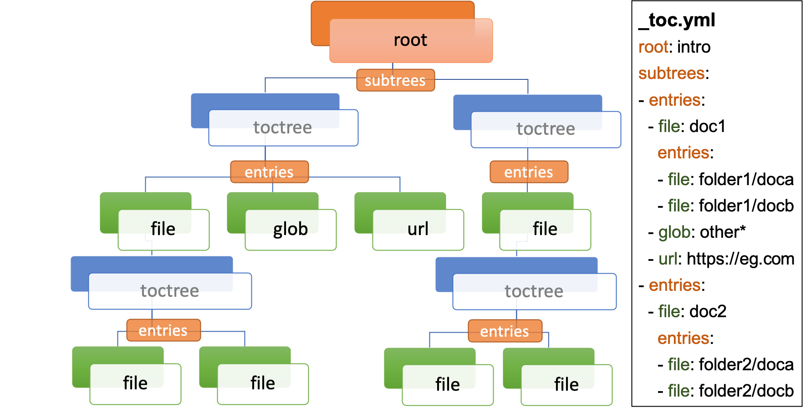

# sphinx-external-toc

A sphinx extension that allows the documentation site-map (a.k.a Table of Contents) to be defined external to the documentation files.

In normal Sphinx documentation, the documentation site-map is defined *via* a bottom-up approach - adding [`toctree` directives](https://www.sphinx-doc.org/en/master/usage/restructuredtext/directives.html#table-of-contents) within pages of the documentation.

This extension facilitates a **top-down** approach to defining the site-map structure, within a single YAML file.

:::{figure-md}


Example ToC
:::

It also allows for documents not specified in the ToC to be auto-excluded.

```{tableofcontents}
```
